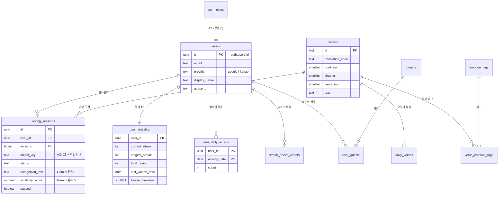

# Re-Verse 데이터베이스 모델링

> **문서 목적**: 팀 리뷰용 데이터 모델 설계안. 전체 ERD → 도메인별 테이블 상세 → 논의가 필요한 열린 질문 순으로 정리했습니다.
> 피드백은 각 테이블의 **논의 포인트**와 마지막 **열린 질문** 섹션을 중심으로 부탁드립니다.
>
> - **DB**: Supabase (PostgreSQL)
> - **인증 원천**: Supabase 관리 `auth.users` (소셜 로그인: 구글/카카오)
> - 상태: 초안 (v1) — 리뷰 후 확정

---

## 1. 설계 원칙 & 컨벤션

| 항목 | 규칙 | 이유 |
|---|---|---|
| 스키마 | 앱 테이블은 모두 `public` | Supabase 관례. 인증은 `auth` 스키마가 관리 |
| 네이밍 | 테이블·컬럼 `snake_case`, 복수형 테이블명 | Postgres/Supabase 관례 |
| PK | 사용자 관련은 `uuid`, 대량 참조 데이터(성경 구절)는 `bigint` | uuid는 노출/분산에 안전, 구절은 수만 행이라 정수가 조회·용량 효율적 |
| 시간 | 모두 `timestamptz` (UTC 저장) | 타임존 버그 예방 |
| 점수 | `numeric(5,2)` (0.00~100.00) | Gemini 유사도 점수를 소수 둘째자리까지 |

> 💡 **왜 `uuid`와 `bigint`를 섞나요?** 사용자 ID는 URL·토큰에 실려 외부에 노출되므로 순차 정수(1,2,3…)면 "몇 명인지" "다음 사용자" 등이 추측됩니다. 그래서 uuid. 반면 성경 구절은 내부 참조용 대량 데이터라 추측 위험이 없고, 정수가 인덱스/조인에 더 가볍습니다.

---

## 2. 전체 ERD

> 위 다이어그램은 GitHub·Notion·VS Code(Mermaid 지원)에서 그대로 렌더링됩니다. 안 보이면 raw 텍스트로도 관계 파악이 됩니다.

---

## 3. 도메인별 테이블 상세

테이블을 5개 도메인으로 묶었습니다. **[MVP]** = 초기 필수, **[이후]** = 나중 단계, **[보류]** = 방식 미확정.

### 3-1. 사용자

#### `users` **[MVP]** — 앱 프로필
| 컬럼 | 타입 | 제약 | 설명 |
|---|---|---|---|
| id | uuid | PK, FK→`auth.users.id` (ON DELETE CASCADE) | **auth.users와 동일한 id** |
| email | text | not null | |
| provider | text | not null, check(`google`\|`kakao`) | 로그인 수단 |
| display_name | text | null | 표시 이름 |
| avatar_url | text | null | 프로필 이미지 |
| created_at / updated_at | timestamptz | default now() | |

**논의 포인트**: Supabase는 로그인하면 `auth.users`에 사용자를 자동 생성합니다. 우리 앱 전용 필드(닉네임 등)를 붙이려고 `public.users`를 **따로 두되 id를 똑같이 공유**합니다(1:1). 이러면 조인이 단순하고 동기화 고민이 적습니다.

> 💡 **대안**: `auth.users`만 쓰고 별도 테이블을 안 만들 수도 있지만, `auth` 스키마는 Supabase가 관리해서 우리가 컬럼을 마음대로 못 넣습니다. 그래서 미러 테이블 방식이 일반적입니다.

### 3-2. 성경 데이터

#### `verses` **[MVP]** — 성경 구절 원문
| 컬럼 | 타입 | 제약 | 설명 |
|---|---|---|---|
| id | bigint | PK (identity) | |
| translation_code | text | not null | 번역본 코드 (예: `KO_GAEGAEJEONG` 개역개정). 체계는 아래 표 참고 |
| book_no | smallint | not null | 성경 책 번호 |
| book_name | text | not null | 책 이름(표시용) |
| chapter | smallint | not null | 장 |
| verse_no | smallint | not null | 절 |
| text | text | not null | 구절 본문 |

- **Unique**: `(translation_code, book_no, chapter, verse_no)` — 같은 번역본의 같은 절 중복 방지.

> **결정 (2026-07-06)**: `book_no`의 1~66 범위 `check` 제약은 두지 않기로 했습니다. `verses`는 사용자 입력이 아니라 신뢰된 시딩 스크립트로만 채워지는 참조 테이블이라, DB 레벨 방어보다 시딩 스크립트 검증으로 충분하다고 판단했습니다.

##### `translation_code` 코드 체계

번역본(개역개정/새번역/NIV/ESV…)이 여러 개로 늘어나도 코드가 흔들리지 않도록 명명 규칙을 고정합니다.

**형식**: `{LANG}_{VERSION}` — 전부 **대문자**.
- `LANG`: 언어. **ISO 639-1** 2글자 코드 (예: `KO`, `EN`, 이후 `ZH` 등). `writing_sessions.language`(`ko`/`en`)와 접두사가 정렬됩니다 — Gemini 유사도 검사가 대조할 번역본을 언어로 좁힐 때 활용.
- `VERSION`: 번역본 식별자. 로마자 대문자, **내부에 `_` 미포함**(→ `code.split('_')`가 항상 `[언어, 버전]` 2조각이 되어 파싱이 단순). 한글 번역본은 이름을 로마자화(개역개정 → `GAEGAEJEONG`).
- 예: `KO_GAEGAEJEONG` = 한국어 + 개역개정.

**매핑 테이블** (상태: ✅ 적재됨 / ⬜ 코드만 예약 — 실제 적재는 저작권 확인 후):

| translation_code | 언어 | 번역본 | 상태 · 비고 |
|---|---|---|---|
| `KO_GAEGAEJEONG` | 한국어 | 개역개정 (개역개정판) | ✅ 적재됨 (66권 31,088절). 대한성서공회 저작권 |
| `KO_GAEGAEHANGEUL` | 한국어 | 개역한글 | ⬜ 대한성서공회 저작권 |
| `KO_SAEBEONYEOK` | 한국어 | 새번역 (표준새번역 개정) | ⬜ 대한성서공회 저작권 |
| `KO_GONGDONG` | 한국어 | 공동번역 개정판 | ⬜ 대한성서공회 저작권 |
| `KO_HYUNDAEIN` | 한국어 | 현대인의 성경 | ⬜ 생명의말씀사 저작권 |
| `EN_KJV` | 영어 | King James Version | ⬜ 퍼블릭 도메인 |
| `EN_NIV` | 영어 | New International Version | ⬜ Biblica 저작권 |
| `EN_ESV` | 영어 | English Standard Version | ⬜ Crossway 저작권 |
| `EN_NASB` | 영어 | New American Standard Bible | ⬜ Lockman 저작권 |
| `EN_NLT` | 영어 | New Living Translation | ⬜ Tyndale 저작권 |

> 위 목록은 **예약된 표준 코드**입니다. 새 번역본을 적재할 때는 임의로 코드를 만들지 말고 이 표에서 골라 쓰거나, 없으면 이 표에 먼저 한 줄 추가한 뒤 그 코드로 시딩합니다. 코드는 정의해두되 저작권이 있는 번역본의 본문 적재는 라이선스를 확인한 후 진행합니다(퍼블릭 도메인인 `EN_KJV` 외에는 대부분 저작권 있음).

#### `emotion_tags` **[이후]** — 감정 태그 마스터 (8종)
`code`(PK), `label_ko`, `sort_order`. 예: `comfort`(위로), `hope`(희망), `gratitude`(감사)…

#### `verse_emotion_tags` **[이후]** — 구절 ↔ 감정 (N:M)
`verse_id`, `tag_code`, `weight`. PK `(verse_id, tag_code)`. 감정 기반 추천에 사용.

#### `daily_verses` **[MVP]** — 오늘의 말씀
| 컬럼 | 타입 | 설명 |
|---|---|---|
| activity_date | date PK | 날짜별 1구절 (전역: 모두 같은 구절) |
| verse_id | bigint FK→verses | |

**전역 공통**으로 배정합니다(감정 기반 개인화는 하지 않음 — "선택 부담 제거" 취지에 맞춤). `activity_date`는 서버가 타임존을 계산하지 않고 **클라이언트가 보낸 로컬 날짜 문자열을 그대로 키**로 씁니다(예: `GET /verses/today?date=2026-07-07`). 해당 날짜 행이 있으면 반환하고, 없으면 `verses` 중 랜덤으로 하나 골라 배정합니다. 콘텐츠성 데이터라 클라이언트가 보낸 값을 그대로 신뢰해도 리스크가 없습니다(조작 방지가 필요한 streak과는 성격이 다름).

### 3-3. 필사 기록

#### `writing_sessions` **[MVP]** — 필사 1회 기록 (핵심 테이블)
| 컬럼 | 타입 | 제약 | 설명 |
|---|---|---|---|
| id | uuid | PK | |
| user_id | uuid | FK→users | 누가 |
| book_no | smallint | not null | 필사 범위의 책 번호 (범위 앵커) |
| chapter | smallint | not null | 필사 범위의 장 (범위 앵커) |
| start_verse_no | smallint | not null | 필사 범위 시작 절 (같은 장 내) |
| end_verse_no | smallint | not null | 필사 범위 종료 절 (`>= start_verse_no`) |
| key_verse_id | bigint | FK→verses, **null 허용** | 범위 중 대표로 고른 절. 생성 시 null, `complete`(기록 저장) 때 채움 |
| language | text | not null | 필사 언어 (`ko`/`en`) |
| object_key | text | not null | 업로드된 이미지의 스토리지 키 |
| status | text | default `pending` | `pending`→`uploaded`→`processing`→`completed`/`failed` |
| recognized_text | text | null | Gemini가 이미지에서 읽어낸 전사 텍스트 |
| similarity_score | numeric(5,2) | null | Gemini가 매긴 원문과의 유사도 (0~100) |
| passed | boolean | null | 통과 여부 (유사도 ≥ 임계치) |
| created_at / completed_at | timestamptz | | |

- **인덱스**: `(user_id, created_at desc)` — 내 기록 목록 조회용.

> 💡 **왜 이미지 URL이 아니라 `object_key`인가?** 이미지는 Object Storage에 저장되고, 접근할 때마다 서명된 임시 URL을 발급합니다. URL은 만료되므로 DB엔 **변하지 않는 키**만 저장하는 게 안전합니다.

> **결정 (2026-07-09)**: 프론트 프로토타입의 3개 필사 모드(한/영/**병행**) 중 **병행(bilingual)을 제외**하고 `language`를 `ko`·`en` 택1로 단순화했습니다. 병행이 요구하던 사진 2장이 사라져 `object_key` 1개 구조를 그대로 유지합니다. `language`는 이후 Gemini 유사도 검사가 **어느 번역본과 대조할지** 판단하는 근거로도 쓰입니다. (마이그레이션 `20260709000000_writing_session_language.sql`)

> **결정 (2026-07-09)**: 필사 단위를 **단일 절 → 같은 장 내 절 범위 + 대표 절(key verse)** 로 확장했습니다(→ [열린 질문 ⑤](#5-팀-논의가-필요한-열린-질문) 해소). `verse_id`를 `key_verse_id`로 이름을 바꿔 "범위 중 마음에 새긴 대표 절"을 가리키게 하고, 범위는 `start_verse_no`/`end_verse_no` **경계 두 컬럼**으로 표현합니다(절을 여러 행으로 펼치지 않음 → 한 필사 = 1행 = 잔디/`total_count` +1). 범위를 `start_verse_id`/`end_verse_id`(두 FK)가 아니라 **verse_no 범위**로 둔 이유: `verses.id`는 적재 순서라 연속성이 보장되지 않아 id 산술 범위가 엉뚱한 절을 포함할 수 있습니다. 같은 장 안 `verse_no` 범위로 조회하면 id 연속성에 의존하지 않습니다. 범위 절 목록은 `GET /verses?book&chapter&from&to`로 조회해 클라이언트가 key verse를 고릅니다. **여러 장에 걸친 범위는 제외**(MVP 단순화). (마이그레이션 `20260709010000_writing_session_verse_range.sql`)

> **결정 (2026-07-09, 흐름 A)**: 실제 UX 흐름상 **key verse는 세션 생성이 아니라 이미지 업로드 후 "기록 저장"(complete) 시점에** 정해집니다(① 범위·언어 선택→세션 생성/URL 발급 → ② 이미지 업로드 → ③ 범위 절 나열→key verse 선택 → ④ QT → ⑤ 저장). 그래서 `key_verse_id`를 **nullable**로 바꾸고 `complete` 요청 바디에서 받습니다. 생성 시엔 key verse가 없어 그 앵커(book/chapter)를 못 쓰므로, 범위를 스스로 표현하도록 **`book_no`·`chapter`를 세션에 저장**합니다(`start/end_verse_no`는 상대 번호라 book/chapter 없이는 의미가 없음). 대표 절이 세션 범위(같은 책·장 + verse_no ∈ [start,end]) 안인지는 `complete`에서 검증합니다. QT(묵상/적용/기도)는 형식 미정이라 이번 `complete` 바디에선 제외(`keyVerseId`만). (마이그레이션 `20260709020000_writing_session_defer_key_verse.sql`)

> **결정 (2026-07-06)**: 필사 유사도 검사를 **별도 OCR 워커(PaddleOCR) → Gemini API 직접 호출**로 변경했습니다. NestJS 백그라운드 잡이 `uploaded` 세션을 클레임(→`processing`)해 Gemini를 호출하고, 결과(`recognized_text`/`similarity_score`)를 저장한 뒤 통과 판정합니다. 이에 따라 `ocr_score`(OCR 신뢰도) 컬럼을 제거하고 `ocr_text`를 `recognized_text`로 이름을 바꿨습니다 (마이그레이션 `20260706000000_gemini_similarity.sql`). 별도 잡 큐 테이블(`ocr_jobs`)은 불필요 — [6. 보류/폐기 항목](#6-보류폐기-항목) 참고.

### 3-4. 습관 / 통계

#### `user_statistics` **[MVP]** — 사용자별 집계 (1:1)
| 컬럼 | 타입 | 설명 |
|---|---|---|
| user_id | uuid PK, FK→users | |
| current_streak | int | 현재 연속 일수 |
| longest_streak | int | 최고 기록 |
| total_count | int | 총 필사 수 |
| last_written_date | date | 마지막 필사 날짜 (streak 계산용) |
| freeze_available | smallint | 보유한 streak 보호권 수 |

#### `user_daily_activity` **[MVP]** — 일자별 활동 (잔디 시각화)
| 컬럼 | 타입 | 설명 |
|---|---|---|
| user_id | uuid | (PK) |
| activity_date | date | (PK) |
| count | int | 그날 통과한 필사 수 (잔디 진하기 결정) |

> **결정 (2026-07-05)**: MVP는 잔디(횟수 기반)만 구현합니다. 별(밤하늘) 시각화 관련 컬럼은 **보류 상태** — [6. 보류/폐기 항목](#6-보류폐기-항목) 참고.

> **결정 (2026-07-07)**: `activity_date`는 서버 UTC 날짜로 기록합니다. 사용자 로컬 타임존에 따라 "하루" 경계가 체감과 어긋날 수 있다는 한계가 있으나(예: UTC-8 사용자는 로컬 오후 4시에 날짜가 바뀜), 수직 슬라이스 범위에서는 단순화합니다. 사용자별 타임존 저장/반영은 추후 과제.

> 💡 **왜 `user_statistics`와 `user_daily_activity`를 나누나?** 하나는 "현재 상태 요약"(streak 몇 일, 총 몇 회 — 사용자당 **1행**), 다른 하나는 "날짜별 히스토리"(잔디 그리려면 하루당 **1행**)입니다. 성격이 달라서 나눠야 조회가 깔끔합니다.

#### `streak_freeze_events` **[MVP]** — freeze 적립/사용 이력
`type`(`earned`/`used`), `reason`. 보유 수는 `user_statistics.freeze_available`에 캐시하고, 이력은 여기에 쌓습니다(append-only). **freeze 지급 규칙은 → 열린 질문 ②**.

### 3-5. 게임화 **[이후]**

#### `quests` / `user_quests`
퀘스트 정의(`quests`: code, title, type, goal, reward)와 사용자별 진행(`user_quests`: progress, completed_at, claimed_at). MVP 이후 단계에서 다룹니다.

---

## 4. 구현 우선순위

| 단계 | 테이블 |
|---|---|
| **MVP (먼저)** | users, verses, daily_verses, writing_sessions, user_statistics, user_daily_activity, streak_freeze_events |
| **이후** | emotion_tags, verse_emotion_tags(추천), quests, user_quests(게임화) |

> MVP 7개 테이블은 `supabase/migrations/20260705000000_init_schema.sql`에 작성 완료되었습니다. 보류 항목은 → [6. 보류/폐기 항목](#6-보류폐기-항목).

---

## 5. 팀 논의가 필요한 열린 질문

1. **유사도 통과 임계치**: 초안 85%. Gemini의 한국어 손글씨 판정 편차를 실측 후 조정 필요. 임계치를 코드 상수로 둘지, 설정값/구절 난이도별로 둘지?
2. **streak 보호권(freeze) 규칙**: 며칠 연속하면 몇 개 지급? 주당/총 상한? 빠진 날 자동 소모할지?
3. **시각화 지표**: 밤하늘 별의 밝기/크기/색을 각각 어떤 데이터에 연결할지 (유사도? 글자수? 연속일?). → 저장할 컬럼이 달라짐. **MVP는 잔디(횟수)만 구현, 별 관련 컬럼은 확정 후 추가 예정.**
4. **감정 태그 8종 확정**: 목록과 추천 알고리즘(단순 랜덤 vs 가중치 vs 이력 기반).
5. **필사 단위**: 한 절만? 아니면 여러 절(구절 묶음)도 허용? 후자면 `verses`에 범위 컬럼 추가 필요.

---

## 6. 보류/폐기 항목

방식/기준이 아직 확정되지 않아 스키마 구현을 미룬 항목들입니다. 각 항목은 확정될 때 별도 마이그레이션으로 추가합니다.

#### ~~`ocr_jobs` — OCR 비동기 잡~~ **(폐기, 2026-07-06)**
당초 별도 파이썬 OCR 워커와의 잡 큐 연동을 위해 설계했으나, **유사도 검사를 Gemini API 직접 호출로 변경**하면서 폐기했습니다. Gemini를 NestJS가 직접 호출하므로 크로스-프로세스 조율용 잡 테이블이 필요 없고, 비동기 처리는 `writing_sessions.status`(`uploaded`→`processing`→`completed`/`failed`)를 잡 상태로 삼아 인프로세스로 수행합니다.

#### 별(밤하늘) 시각화 컬럼
`user_daily_activity`에 유사도·글자수 기반 컬럼(`best_similarity`, `total_char_count` 등)을 추가할지는 열린 질문 ③(시각화 지표)이 확정된 후 결정합니다. MVP는 잔디(횟수) 시각화만 구현합니다. → 확정 조건: 별의 밝기/크기/색이 어떤 지표에 연결되는지 결정.

---

## 부록. Supabase 특이사항

- **`auth.users` 관계**: 로그인 시 Supabase가 자동 생성. 우리 `public.users`는 같은 id로 미러링(로그인 최초 요청 때 백엔드가 자동 생성 예정).
- **RLS(Row Level Security)**: 모든 DB 접근은 백엔드(신뢰 서버)가 담당하므로 기본은 백엔드 권한으로 처리하고, 심층 방어로 "본인 데이터만 읽기" 정책을 최소한으로 걸어두는 방향. (리뷰 후 상세 정책 확정)
